# 🚗 EV Store Project 4413

  
  
  
  

> This is a full-stack e-commerce application built using Spring Boot for the backend and React.js for the frontend. It allows users to browse and purchase electric vehicle-related products. The backend communicates with a MySQL database, and the project is structured for easy development using Maven and Eclipse (with Spring Tool Suite).

---

## 🖼️ UI Preview

| Image | Filename | Description |
|:-----:|:--------:|:------------|
| 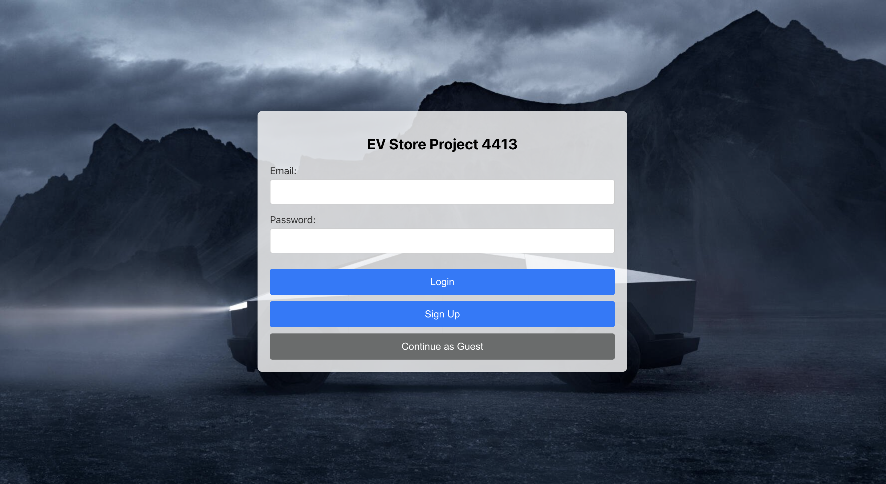 | **homepage.png** | **Homepage**: Sleek, modern design with a futuristic EV background. Users can log in, sign up, or browse as a guest—all within a clean, professional layout. :contentReference[oaicite:16]{index=16} |
| 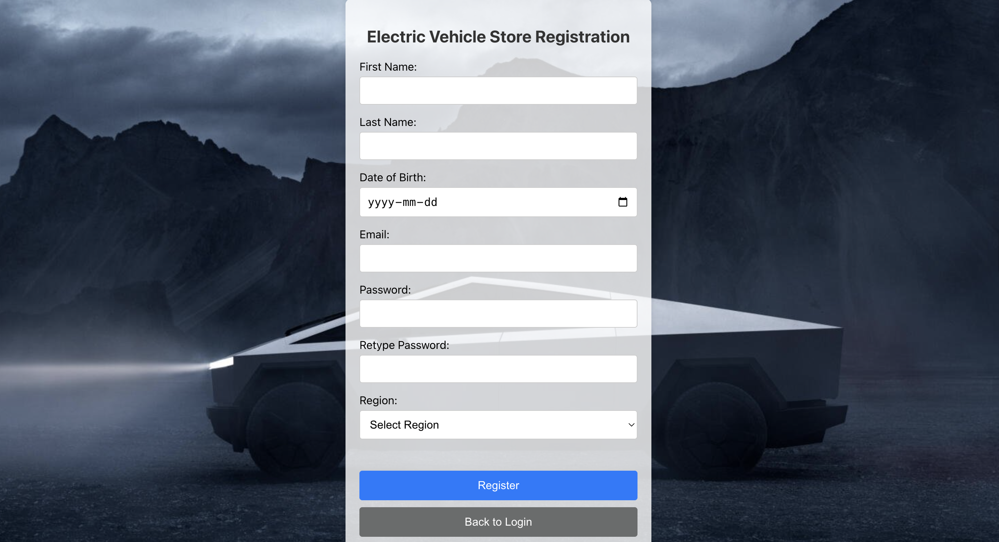 | **registration_interface.png** | **Registration Interface**: Secure onboarding form for name, DOB, email, password (with confirmation), and region, plus a “Back to Login” button—set against an EV-themed backdrop. :contentReference[oaicite:17]{index=17} |
|  | **vehicle_catalog.png** | **Vehicle Catalog**: Inventory page with powerful search filters and organized cards—users can compare models by price, features, and style in a sleek interface. :contentReference[oaicite:18]{index=18} |
| 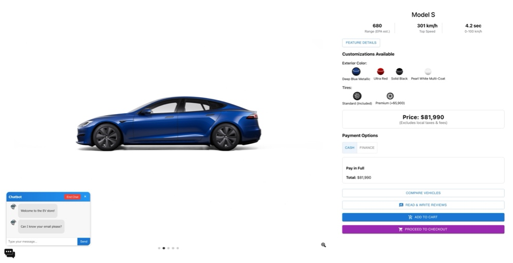 | **vehicle_page.png** | **Vehicle Page**: Detailed product view showing full specs, visual previews, customization options, and purchase tools—plus a built-in chatbot. :contentReference[oaicite:19]{index=19} |
| 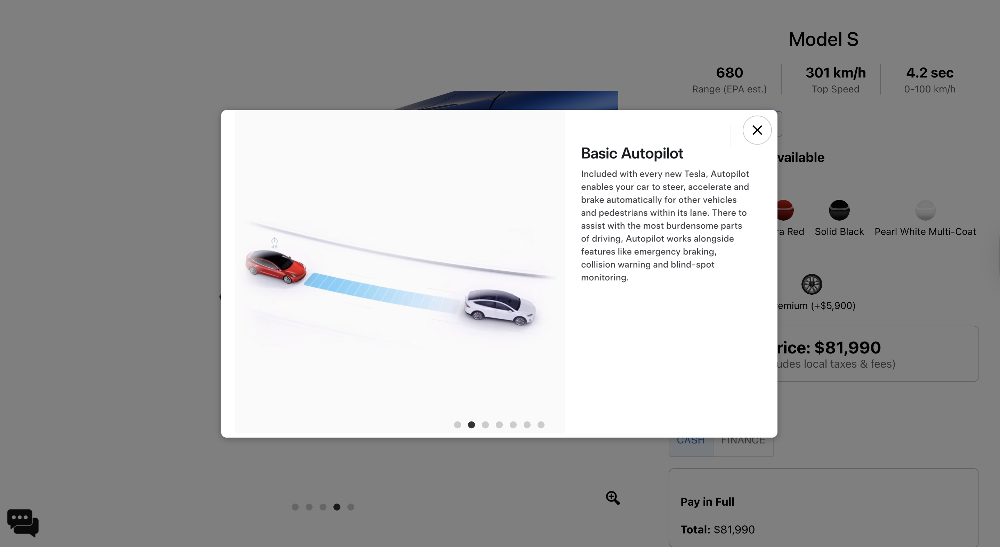 | **features_details_button.png** | **Features Details Button**: Opens a pop-up showcasing detailed specs of the selected model. :contentReference[oaicite:21]{index=21} |
| 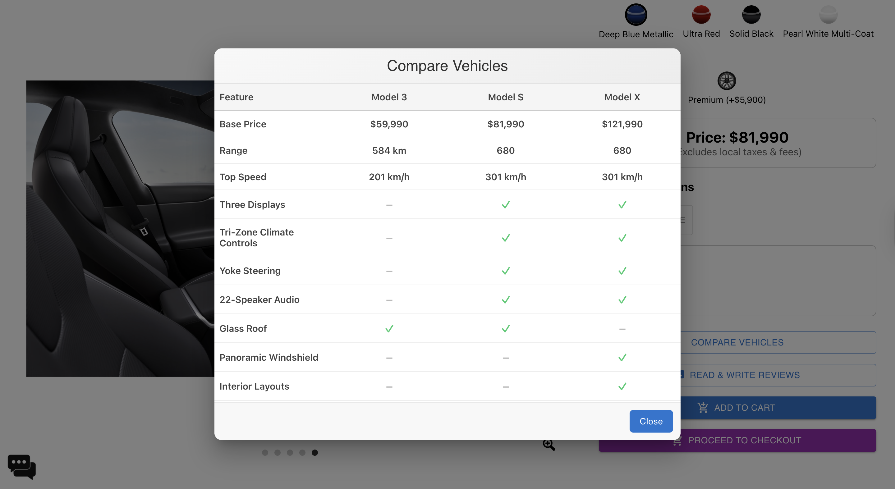 | **compare_vehicles.png** | **Compare Vehicles**: Pop-up comparing Model 3, S, and X by price, range, speed, and premium features. :contentReference[oaicite:22]{index=22} |
| 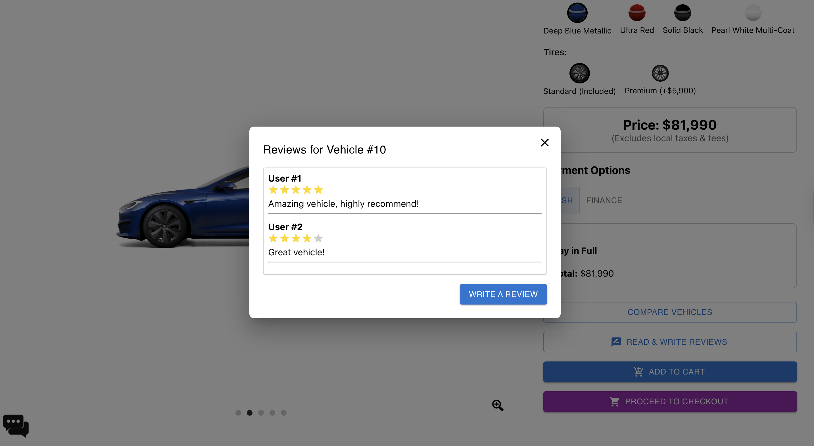 | **review_popup.png** | **Review Submission Popup**: Lets users rate vehicles and share—or read—customer feedback in a simple interface. :contentReference[oaicite:23]{index=23} |
| 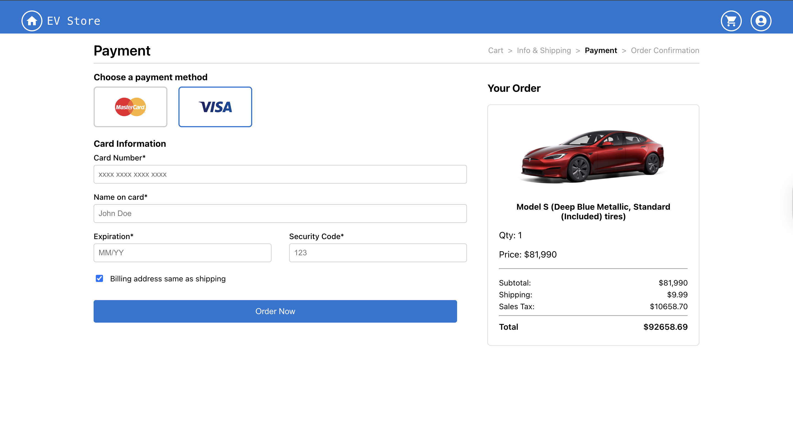 | **payment_page.png** | **Payment Page**: Secure, clean checkout form for credit-card payments with clear order details. :contentReference[oaicite:24]{index=24} |
| 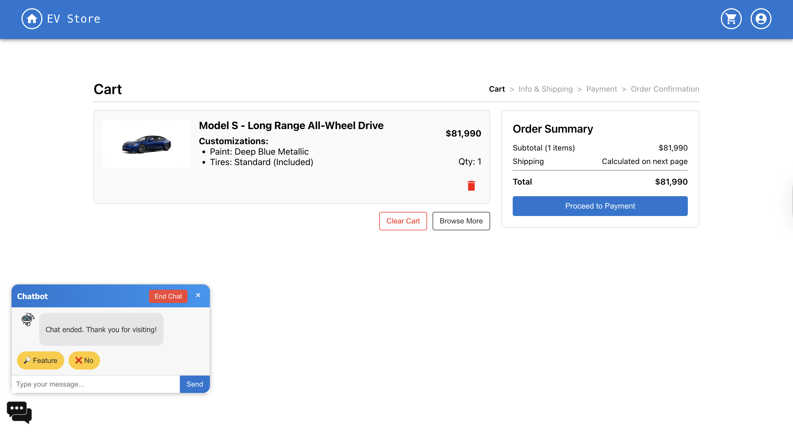 | **cart_page.png** | **Cart Page**: Summary of selected EV(s) and configurations, with easy remove/continue-shopping controls. :contentReference[oaicite:25]{index=25} |
| 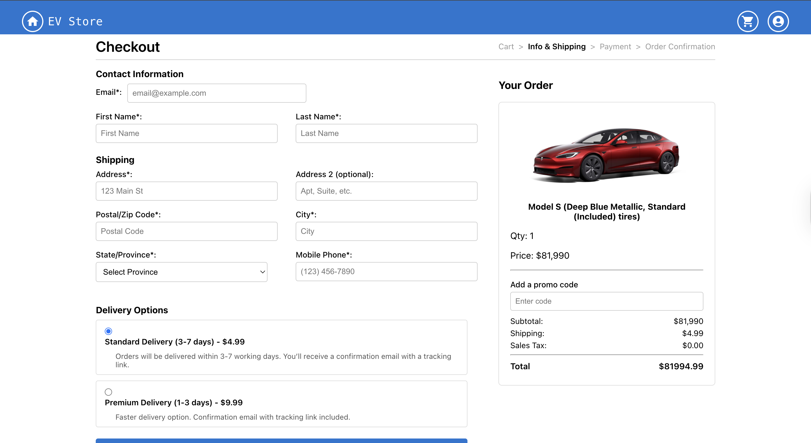 | **checkout_page.png** | **Checkout Page**: Captures shipping/contact info and preferred delivery method, with an order summary sidebar. :contentReference[oaicite:26]{index=26} |
| 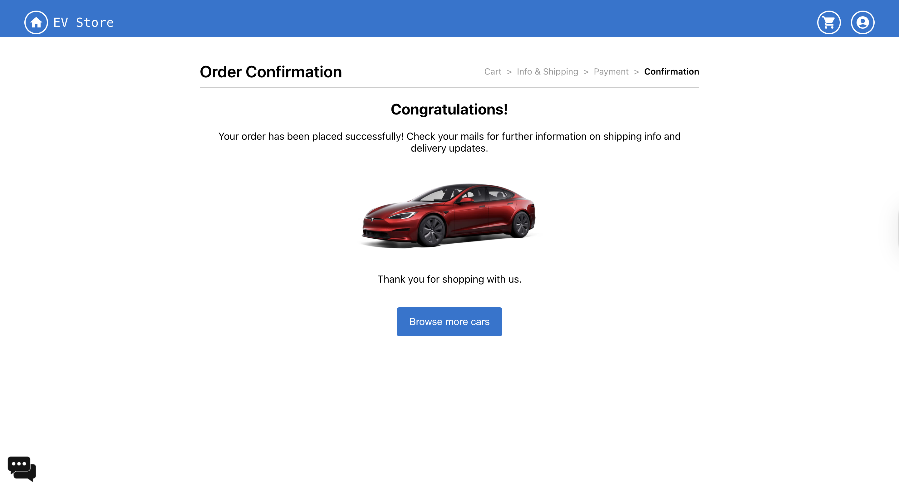 | **confirmation_page.png** | **Order Confirmation Page**: Minimal confirmation screen assuring users their order was received, plus next-step messaging. :contentReference[oaicite:27]{index=27} |
| 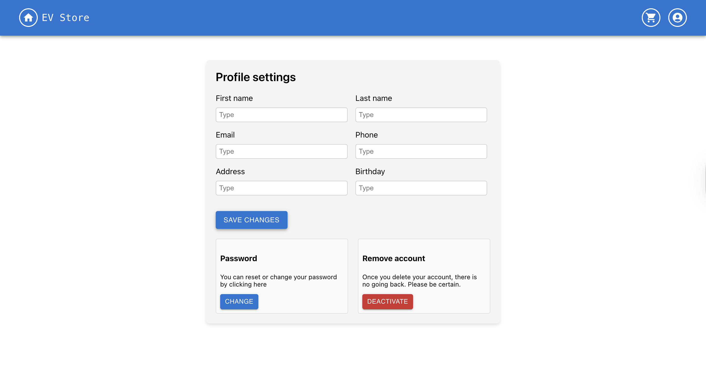 | **profile_settings.png** | **Profile Settings Page**: Manage personal details, change password, or delete account in a simple, secure UI. :contentReference[oaicite:28]{index=28} |
| 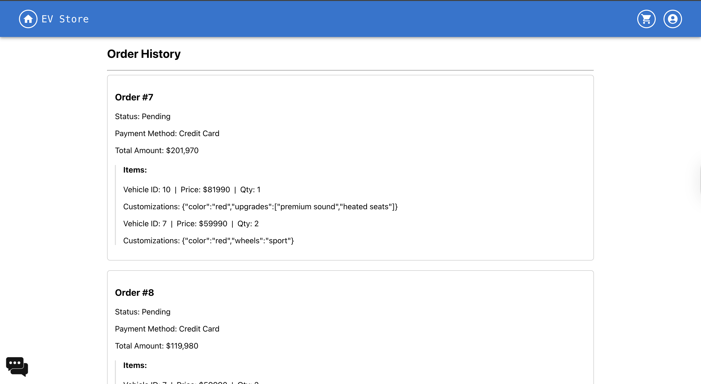 | **order_history.png** | **Order History Page**: Detailed breakdown of past orders (ID, price, quantity, customizations) for easy tracking. :contentReference[oaicite:29]{index=29} |
| 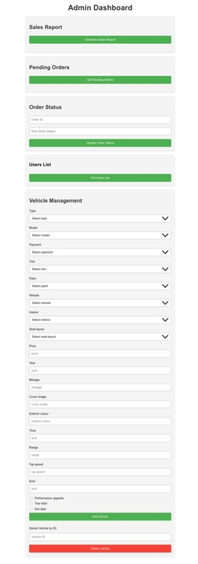 | **admin_dashboard.png** | **Admin Dashboard**: All-in-one control center for sales reports, pending orders, user lists, vehicle management, and order status updates. :contentReference[oaicite:30]{index=30} |
